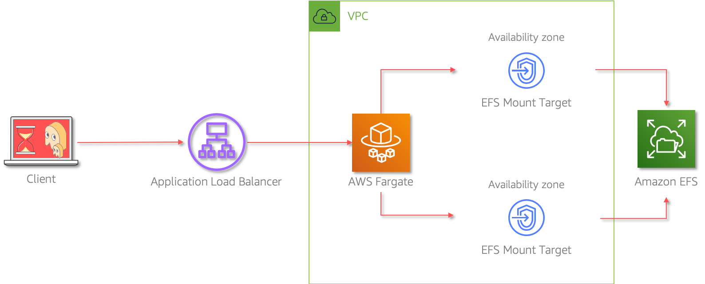

# AWS Fargate with Persistent Storage

Mystique Unicorn App is a building new application. The web service component of this application will be running on containers. The team has decided to use AWS Fargate as it allows them to run containers without having to manage servers. The containers need to have access to static files and other web assets that need to be served by the web-server. The team needs a ways to store all these web-assets in a perisistent storage and attach them to the containers. The team is looking for your help to achieve this. Can you help them?

## 🎯Solutions

We can use AWS Elastic File System with AWS Fargate to achieve this.



In this article, we will build an architecture, similar to the one shown above - A simple `web-server` running _nginx_ container in AWS Fargate. We will use Amazon EFS for peristent storage.

1.  ## 🧰 Prerequisites

    This demo, instructions, scripts and cloudformation template is designed to be run in `us-east-1`. With few modifications you can try it out in other regions as well(_Not covered here_).

    - 🛠 AWS CLI Installed & Configured - [Get help here](https://youtu.be/TPyyfmQte0U)
    - 🛠 AWS CDK Installed & Configured - [Get help here](https://www.youtube.com/watch?v=MKwxpszw0Rc)
    - 🛠 Python Packages, _Change the below commands to suit your OS, the following is written for amzn linux 2_
      - Python3 - `yum install -y python3`
      - Python Pip - `yum install -y python-pip`
      - Virtualenv - `pip3 install virtualenv`

1.  ## ⚙️ Setting up the environment

    - Get the application code

      ```bash
      git clone https://github.com/miztiik/fargate-with-efs
      cd fargate-with-efs
      ```

1.  ## 🚀 Prepare the dev environment to run AWS CDK

    We will cdk to be installed to make our deployments easier. Lets go ahead and install the necessary components.

    ```bash
    # If you DONT have cdk installed
    npm install -g aws-cdk

    # Make sure you in root directory
    python3 -m venv .env
    source .env/bin/activate
    pip3 install -r requirements.txt
    ```

    The very first time you deploy an AWS CDK app into an environment _(account/region)_, you’ll need to install a `bootstrap stack`, Otherwise just go ahead and deploy using `cdk deploy`.

    ```bash
    cdk bootstrap
    cdk ls
    # Follow on screen prompts
    ```

    You should see an output of the available stacks,

    ```bash
    vpc-stack
    efs-stack
    fargate-with-efs
    efs-content-creator-stack
    ```

1.  ## 🚀 Deploying the application

    Let us walk through each of the stacks,

    - **Stack: efs-stack**
      There are few resources that are prerequisites to create the EFS share. This stack will create the following resources,

      - A VPC to host our EFS share - _Deployed by the dependant stack `vpc-stack`_
      - Security group for our EFS share allowing inbound `TCP` on ort `2049` from our VPC IP range
      - Posix user & acl `1000` - _In case you want to use OS level access restrictions, these will come in handy_
      - EFS Access Point to make it easier to mount to Lambda and apply resource level access restrictions
        - The default path for the access point is set to `/efs`
        - Another access point exclusively for the web assets - `/nginx/html`

      Initiate the deployment with the following command,

      ```bash
      cdk deploy efs-stack
      ```

    - **Stack: fargate-with-efs**

      This stack: _fargate-with-efs_ will create a ECS cluster and create a task and container definition with most sane defaults. For the container image, we will use `ngnix:latest` image from docker hub. Feel free to change the customer image in the stack. By default, ngnix looks for the web assets in this location `/usr/share/nginx/html`. We will ensure our EFS access point `/nginx/html` is made available to our container in this location(`/usr/share/nginx/html`).

      Any content written in our EFS share at `/nginx/html` will be accessible within the container at `/usr/share/nginx/html`. This stack does **NOT** add any web assets in the EFS, so when we launch the nginx service, we will only be able to see the default welcome page. We will _later_ use a lambda function to write something to EFS and check if our nginx service is able to display it.

      Initiate the deployment with the following command,

      ```bash
      cdk deploy fargate-with-efs
      ```

      Check the `Outputs` section of the stack to access the `webAppServiceUrl`. Try to open this url in the browser, you should be able to see a nginx welcome message.

1.  ## 🔬 Testing the solution

    We can use a tool like `curl` or `Postman` to query the url. The _Outputs_ section of the respective stacks has the required information on the urls.

    - **Stack: efs-content-creator-stack**

      As noted earlier, our webservice just displays a default welcome page. Just to make it easier to write to our EFS easily, I have setup a lambda function that can write to our EFS share under `/nginx/html`. To make it accessible from the web browser attached an API GW to the lambda as well. This will allows to write content to EFS by making `POST` calls.

      This stack: _efs-content-creator-stack_ creates an REST API with a lambda backend. This lambda function will be deployed in the same VPC as our EFS share and use the same security group(_TODO: Host lambda in a independant security group_). The stack mounts the EFS Access point to our lambda function, there-by enabling us to read and write to our EFS share.

    Initiate the deployment with the following command,

    ```bash
    cdk deploy efs-content-creator-stack
    ```

    Check the `Outputs` section of the stack to access the `ContentCreatorApiUrl`

    ```bash
    $ CONTENT_CREATOR_URL="https://vukwv5c41b.execute-api.us-east-1.amazonaws.com/prod/well-architected-api/create-content"
    $ curl -X POST -H 'Content-Type: text/plain' -d 'Hello again :)' ${CONTENT_CREATOR_URL}
    ```

    _Expected Output:_

    ```json
    {
      "message": "Message added successfully! Go Rock the world",
      "lambda_version": "$LATEST",
      "ts": "2020-09-09 21:18:54.199807"
    }
    ```

    Now open the `webAppServiceUrl` in the browser, you should be able to see the message you added in the `curl` command.

1.  ## 📒 Conclusion

    Here we have demonstrated how to use EFS along with AWS Fargate to create a persistent storage for your containers. This can be really helpful in a variety of situations. For example,

    - _Developer Tools:_ JIRA, Jenkins, Artifactory & Git
    - _Content Management:_ WordPress, Drupal
    - _Shared Notebooks:_ Jupyter & Jupyterhub
    - _Machine Learning:_ MXNet, TensorFlow

    If you know of other usecases for using EFS with lambda, do let me know.

1.  ## 🧹 CleanUp

    If you want to destroy all the resources created by the stack, Execute the below command to delete the stack, or _you can delete the stack from console as well_

    - Resources created during [Deploying The Application](#deploying-the-application)
    - Delete CloudWatch Lambda LogGroups
    - _Any other custom resources, you have created for this demo_

    ```bash
    # Delete from cdk
    cdk destroy

    # Follow any on-screen prompts

    # Delete the CF Stack, If you used cloudformation to deploy the stack.
    aws cloudformation delete-stack \
      --stack-name "MiztiikAutomationStack" \
      --region "${AWS_REGION}"
    ```

    This is not an exhaustive list, please carry out other necessary steps as maybe applicable to your needs.

## 📌 Who is using this

This repository aims to teach best practices & advanced file system techniques to new developers, Solution Architects & Ops Engineers in AWS. Based on that knowledge these Udemy [course #1][103], [course #2][102] helps you build complete architecture in AWS.

### 💡 Help/Suggestions or 🐛 Bugs

Thank you for your interest in contributing to our project. Whether it is a bug report, new feature, correction, or additional documentation or solutions, we greatly value feedback and contributions from our community. [Start here][200]

### 👋 Buy me a coffee

[](https://ko-fi.com/Q5Q41QDGK) Buy me a [coffee ☕][900].

### 📚 References

1. [Developers guide to using Amazon EFS with Amazon ECS and AWS Fargate – Part 3][1]

### 🏷️ Metadata

**Level**: 300


[1]: https://aws.amazon.com/blogs/containers/developers-guide-to-using-amazon-efs-with-amazon-ecs-and-aws-fargate-part-3/
[100]: https://www.udemy.com/course/aws-cloud-security/?referralCode=B7F1B6C78B45ADAF77A9
[101]: https://www.udemy.com/course/aws-cloud-security-proactive-way/?referralCode=71DC542AD4481309A441
[102]: https://www.udemy.com/course/aws-cloud-development-kit-from-beginner-to-professional/?referralCode=E15D7FB64E417C547579
[103]: https://www.udemy.com/course/aws-cloudformation-basics?referralCode=93AD3B1530BC871093D6
[200]: https://github.com/miztiik/fargate-with-efs/issues
[899]: https://www.udemy.com/user/n-kumar/
[900]: https://ko-fi.com/miztiik
[901]: https://ko-fi.com/Q5Q41QDGK
